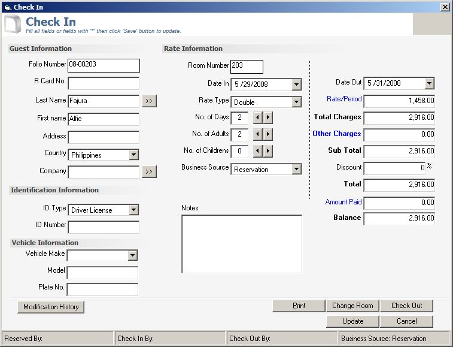



## A Hotel Management System

### Description

Update:

Program closed when changing the dtpDateIn value in Check In form.

Hotel management system - This is a complete application for Hotel Management System. The source code contain advance programming specially in using SQL Language.

Basic features:

1. Guest reservation

2. Billing System

3. Change room

4. Multiple account per room

5. Guest report

6. Other charges

The manual for this application and ocx file will be posted at www.sourcecodester.com.

Note: I have enabled the default menu because some programmer can not use the menu I have included using ocx file.

Visit www.sourcecodester.com for username and password.
 
### More Info
 

             |
---                |---
**Submitted On**   |2008-11-18 13:55:02
**By**             |[jaypabs](https://github.com/Planet-Source-Code/PSCIndex/blob/master/ByAuthor/jaypabs.md)
**Level**          |Advanced
**User Rating**    |4.3 (56 globes from 13 users)
**Compatibility**  |VB 6\.0
**Category**       |[Complete Applications](https://github.com/Planet-Source-Code/PSCIndex/blob/master/ByCategory/complete-applications__1-27.md)
**World**          |[Visual Basic](https://github.com/Planet-Source-Code/PSCIndex/blob/master/ByWorld/visual-basic.md)
**Archive File**   |[A\_Hotel\_Ma2147153182009\.zip](https://github.com/Planet-Source-Code/jaypabs-a-hotel-management-system__1-71222/archive/master.zip)

